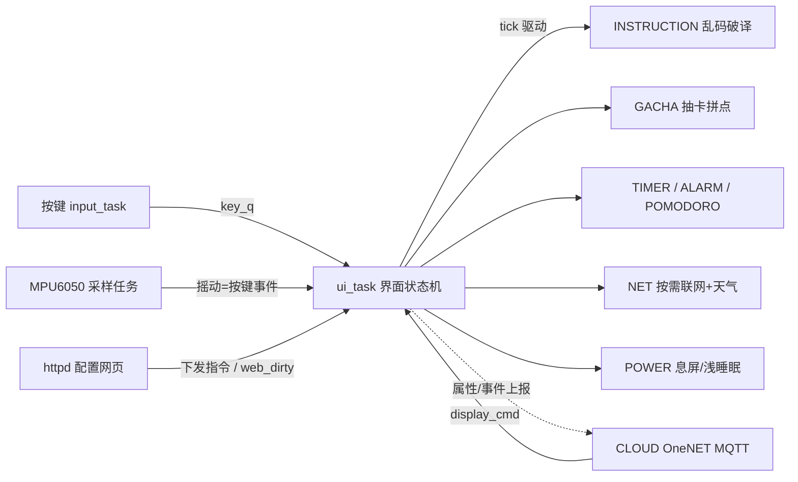

# Prescript Beeper · ESP32-S3 食指BB机 / 个人终端

[English](README_EN.md) · 中文

一台传呼机（BB 机）造型的桌面个人终端固件：284×76 自绘 UI、三键 + 摇动操作、喇叭/蜂鸣音效，整合 **时钟天气 / 指令乱码破译 / 抽卡拼点 / 闹钟倒计时 / 待办 / 答案之书 / 每日神谕推送**；手机或电脑浏览器即可完成**离线配网、全量配置与指令下发**。

- 平台：ESP32-S3 (WROOM-1 N16R8) · ESP-IDF v5.5.5 · FreeRTOS · C
- 闪存：16MB（OTA 双分区，ota_0/ota_1 各 2MB）
- 大部分代码基于 vibe coding 起步，经四轮系统性审计持续加固（累计修复 80+ 项），工程化与文档齐全
---


## 功能

### 主菜单

| 菜单 | 功能 |
|------|------|
| **神谕** | 随机抽取一条指令，全屏乱码逐字破译显示（支持 `{RAND}`、`{#RRGGBB}` 等内联标签） |
| **TTL协议** | 锚定时间（闹钟）/ 跨越时间（倒计时）/ 番茄钟 |
| **待办** | 指令日志：`{TODO}` 指令自动入库，PASS 标记，网页同步 |
| **联网** | 连接网络 / 连接云端(OneNET 开关) / 查看天气 / 显示IP / 配网 / 版本更新(OTA) |
| **观测** | 抽卡：十连 / 单抽 / 拼点 / 图鉴 / 积分 |
| **询问** | 答案之书：回答 / 吃什么 / 喝什么 / 玩什么（内置 + 网页自定义） |
| **使用者** | 切换当前使用者（网页可增）；不同使用者收不同专属指令 |
| **设置** | 音量/蜂鸣/按键音；息屏/息屏时钟/主题（柔和绿/赛博青/深夜黑/标准黑白）/光标/破译字；摇动/平衡互换；系统信息、初始化 |
| *织机(隐藏)* | 彩蛋：主界面 Konami 手势（上上下下左右左右）解锁，「纺织时间」时间加速、「纺织记忆」白框滤镜、平衡姿态页 |

### 效果

- **指令乱码破译**：先全乱码抖动，再逐字揭示；支持 `{#RRGGBB}` 颜色、`{RAND:min-max}` 随机数、`{TODO}` 自动入待办，字号 16/24/32/64px。
- **抽卡系统**：十连扫描线动画、金人格语音打字机、积分单抽；硬币**拼点**小游戏累计伤害积分/连胜；12 罪人 × 120 人格收集图鉴。
- **时间管理**：闹钟（每天/工作日/周末/一次性/自定义星期）、倒计时到点蜂鸣+自动亮屏、番茄钟（工作/休息自动轮换）、每日神谕定时推送。
- **离线可用**：DS1302 上电即显时间，断电由模块电池续走；无网络也能用全部本地功能。
- **浅睡眠低功耗**：50ms 定时片睡 + 挂起采样任务 + 停 WiFi；唤醒后不自动重连，联网由「联网 → 连接网络」手动开启（「远程在线」开启时则保持在线不休眠断网）。
- **网页全量配置**：WiFi/天气/指令库/外观/闹钟/待办/使用者/破译参数/图鉴/云端(OneNET)，全部 NVS 持久化，重启不丢。

## 架构与工程化



- **组件化分层**：16 个功能组件 + `COMMON` 公共头；UI 帧缓冲绘制接口复用给破译/抽卡/计时等全屏界面。
- **双任务事件驱动**：input_task 高优先级按键轮询 + ui_task 统一状态机驱动与绘制（LCD 单写者，杜绝并发绘制花屏）；cloud_task 独立驱动 MQTT 会话。
- **并发治理**：闹钟/待办/指令库/答案库/抽卡/使用者等 httpd 与 UI 共享数据全部互斥保护；音频播放参数经长度 1 队列原子传递；绘制统一收口 ui_task。
- **四轮系统性审计**：两轮全库审计 + 两轮云端专项子代理交叉审查，累计修复 80+ 项问题（网页配置"半保存"事务化、NVS 写合并 37 次→≤8 次 commit、双核数据竞态、摇动误触过滤、注释漂移等）。
- **安全**：网页 POST 全量 CSRF token 校验；WiFi/天气/OneNET 凭据仅存 NVS 不入源码；配网热点密码每台设备随机生成。
- **发布规范**：`version.txt` 统一管理版本号；OTA 双分区 + SHA256 + 启动回滚防护；GitHub Release 附固件与更新说明。

## 云端 OneNET（可选，v1.14）

「远程在线」默认关闭，不影响任何本地功能。开启后设备经 MQTT 接入中国移动 OneNET Studio 物联网平台，接入参数 `mqtt://mqtts.heclouds.com:1883`（clientId=设备名，username=产品ID，password=安全鉴权 token）：

| 链路 | 内容 | 频率 |
|------|------|------|
| 属性上报 | `battery` / `rssi` / `version` / `alarm_cnt` | 连上即报 + 每 60s |
| 事件上报 | `alarm_fire` 闹钟到点 / `todo_remind` 待办提醒 / `daily_sign` 每日神谕（参数 `msg`） | 触发即报 |
| 下行指令 | 服务 `display_cmd`（入参 `msg`）→ 屏幕乱码破译显示 + 回执 | 平台随时 |

### 平台侧配置（OneNET 控制台）

1. 注册 [open.iot.10086.cn](https://open.iot.10086.cn) 并完成实名认证 → 物联网平台（OneNET Studio）→ 创建产品：接入协议 **MQTT**、数据协议 **OneJSON**、联网方式 **WiFi**。
2. 功能定义按上表创建（**标识符必须与上表完全一致**）：属性 4 个（`battery` int32 / `rssi` int32 / `version` text / `alarm_cnt` int32）、事件 3 个（`alarm_fire` / `todo_remind` / `daily_sign`，info 级，参数 `msg` text）、服务 1 个（`display_cmd`，入参 `msg` text、`timeout` int32）。
3. 创建设备，记录三元组 **ProductID / DeviceName / DeviceKey**。
4. 建议先手动验证：PC 运行 `python tools/onenet_token.py <ProductID> <DeviceName> <DeviceKey>` 生成 token，MQTTX 连 `mqtt://mqtts.heclouds.com:1883`（clientId=DeviceName，username=ProductID，password=token），平台设备详情显示「在线」即三元组正确。

### 设备侧配置

联网后打开设备配置页 → 「☁ 云端 OneNET」卡片：填入三元组、勾选启用、保存。DeviceKey 只存设备 NVS，网页不回显明文（掩码=保持不变）。

> 注意：启用期间设备保持在线、不进浅睡眠待机（耗电相应增加）；DeviceKey 泄露可在平台重置设备密钥。

## 硬件

### 接线（ESP32-S3）

| 模块 | 引脚 |
|------|------|
| LCD ST7789 284×76（SPI2 60MHz） | SCL=`7` SDA=`8` CS=`9` RST=`10` DC=`11` BLK=`12`（背光低电平点亮） |
| 按键 上 / 下 / 确认（内部上拉，按下=低；PCB 版实测 上=`5` 下=`6` 确认=`4`） | 见左 |
| 有源蜂鸣器模块（高电平触发：高=响 低=静） | `15` |
| MAX98357A 功放（I2S） | BCLK=`16` LRC=`17` DIN=`18` SD=`13`（低=关断防刺声） |
| DS1302 RTC（三线 bit-bang） | CLK=`2` DAT=`14` CE/RST=`21` |
| MPU6050 六轴（软件 I2C） | SCL=`39` SDA=`38` |
| 电池电压 ADC（1S 锂电，1:1 分压） | `1`（ADC1_CH0） |
| 串口日志（115200） | `43`(TX) `44`(RX) |

> 引脚如需调整：按键在 `components/UI/UI.h`，其余在各组件 `.c` 顶部注释标明。注意避开 N16R8 的 GPIO35/36/37（内部 PSRAM 占用）、GPIO48（板载 RGB）与 strapping 引脚。

## 使用方法

### 构建与烧录

环境：Windows + ESP-IDF v5.5.5，USB 串口驱动就绪。

**方式一 · ESP-IDF 原生（推荐）**

```powershell
cd oder
idf.py build
idf.py -p COM9 flash
```

**方式二 · esptool 直烧**（`--before default_reset` + `--after hard_reset` 为正常两次开机；`python` 为已激活的 ESP-IDF 环境）

```powershell
python -m esptool --chip esp32s3 -p COM9 -b 460800 --before default_reset --after hard_reset write_flash `
  --flash_mode dio --flash_size 16MB --flash_freq 80m `
  0x0 build\bootloader\bootloader.bin 0x8000 build\partition_table\partition-table.bin 0x10000 build\oder.bin
```

产物：`build/oder.bin`（约 1.57MB）。

### 按键操作

- **上 / 下**：滚动菜单；长按进入连发（快速连续滚动）。
- **OK**：确认 / 进入当前项。
- **长按 OK**：返回上一级 / 退出当前界面。
- **摇动**（需在「设置 → 摇动」开启）：上摇=上滑、下摇=下滑、左摇=确定、右摇=长按确定退出.

### 配网与网页配置

1. 主菜单 **联网 → 开启配网**，开启热点 `ESP32ODERAP`（密码由设备随机生成，开启时显示在屏幕上）。
2. 手机连接该热点 → **自动弹出**配置页（captive portal），或手输 `http://192.168.4.1/`。
3. 在配置页扫描/保存 WiFi、填天气城市与**天气 API Key（心知天气）**，设备转为联网模式。
4. 之后设备与手机/电脑同一网络时，浏览器访问设备 IP（状态页会显示）即可全量管理。

 ### 备注

0. **版本号修改方式**：编辑项目根目录 `version.txt`，改成例如 `v1.12`，重新 `idf.py build` 即可；不要改代码宏。
1. **本项目目前只用面包板与模块实现以上功能但是不完善,正在更新pcb版**

>  **隐私**：本仓库不内置任何个人 WiFi SSID/密码或天气 API Key——首次须经配置页填写（或写入设备 NVS `net` 命名空间），源码默认留空。
