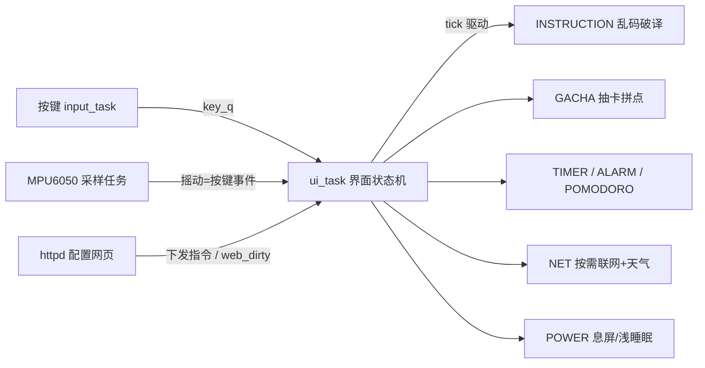

# Prescript Beeper · ESP32-S3 食指BB机 / 个人终端

[English](README_EN.md) · 中文

一台传呼机（BB 机）造型的桌面个人终端固件：284×76 自绘 UI、三键 + 摇动操作、喇叭/蜂鸣音效，整合 **时钟天气 / 指令乱码破译 / 抽卡拼点 / 闹钟倒计时 / 待办 / 答案之书 / 每日神谕推送**；手机或电脑浏览器即可完成**离线配网、全量配置与指令下发**。

- 平台：ESP32-S3 (WROOM-1 N16R8) · ESP-IDF v5.5.5 · FreeRTOS · C
- 闪存：16MB（OTA 双分区，ota_0/ota_1 各 2MB）
- 大部分代码基于 vibe coding，v1.06 已修复主要稳定性问题，仍持续重构优化
- 可复用驱动库：`D:/STM32Project/Library_SK/my_esp32_lib/esp32oder`（独立解耦，含使用说明）
---

## v1.13 更新

- 优化：网页一次保存的 NVS commit 由 25~37 次合并为 ≤8 次(设置/闹钟/答案批量落盘), POST 提速且降低 flash 磨损
- 优化：WiFi 扫描异步化(POST 启动后台任务 + GET 轮询), 扫描期间页面保存/状态轮询不再卡 2~4 秒
- 加固：全部 POST 接口增加 CSRF token 校验(`X-Web-Token` 头), 防同网段恶意网页伪造配置请求
- 修复：音频播放参数改队列原子传递(消除双核下播错长度的竞态); 按键音播完自动恢复破译循环进行音
- 重构：`EVT_*` 按键事件码收拢至 `components/COMMON/evt.h` 全工程唯一来源
- 清理：抽卡卡池 120 条金卡死数据移除(金卡实际走 coin_skills 统一表), 消除双数据源漂移
- 优化：网页配置读取缓冲移到堆(原占 httpd 栈 8.8KB); httpd 并发连接 4→6
- 加固：SPI 发送检查返回值 / 破译参数 dl·rv 服务端上限钳位 / MPU6050 兼容 MPU6500·9250 克隆芯片

## v1.12 更新

- 修复：摇动把「放下/拿起设备」的冲击误判为 确认/退出（平移水平分量阈值 0.8g→1.3g, 竖直翻页不受影响）
- 修复：OTA 下载中息屏进入待机被关 WiFi, 表现为「下载中断」（升级进行中不判息屏、不进待机）
- 修复：积分单抽语音中强退后, 残留标志吞掉下一次十连的语音与结果列表
- 修复：网页闹钟「删 1 加 1」在 16 槽全满时保存失败且半保存（改为先清除后写入, 校验失败不落库）
- 修复：平衡页航向角恒为 ≈0（泄漏积分时间常数 0.3s→10s, 转动可读、静止缓慢回零）
- 加固：ANSWER 答案库 / UI 使用者列表补跨任务互斥锁（与闹钟/待办/指令库/抽卡同一标准）
- 优化：平衡页 10fps 帧率限制, 不再每循环整屏清屏重绘
- 优化：子菜单 center_dx 进子菜单自动归零; 待办列表 2 字节 UTF-8 显示; 设备端新增闹钟找槽语义与网页对齐

## v1.11 更新

- 设置 → 系统信息第 1 页新增：项目名 / 版本号 / 编译日期 / 编译时间
- 版本号统一由项目根目录 `version.txt` 管理，例如 `v1.11`
- OTA 下载界面实时显示百分比进度
- OTA 支持 GitHub 302 重定向
- STA 联网改为手动开关，不再空闲自动断网，避免 OTA 下载中断

## v1.06 更新

- 修复：番茄钟整模块不走时（`POM_Tick` 未接入主循环）
- 修复：番茄钟暂停算法（暂停时倒计时继续走/恢复后双倍扣时）
- 修复：网页保存指令库后设备端不立即生效（新增 64px 指令库独立读写）
- 修复：网页改主题时 httpd 任务直接绘制 LCD 导致花屏风险
- 修复：网页未加载完成就保存可能清空全部闹钟
- 修复：自定义主题色重启后丢失
- 加固：指令库读写接口并发保护，改为“拷贝到调用方缓冲区”
- 新增：`pomodoro_drv` / `power_drv` 可复用驱动库（见上方驱动库路径）

## 功能

### 主菜单

| 菜单 | 功能 |
|------|------|
| **神谕** | 随机抽取一条指令，全屏乱码逐字破译显示（支持 `{RAND}`、`{#RRGGBB}` 等内联标签） |
| **询问** | 答案之书：回答 / 吃什么 / 喝什么 / 玩什么（内置 + 网页自定义） |
| **观测** | 抽卡：十连 / 拼点 / 单抽 / 积分 / 图鉴 |
| **待办** | 指令日志：`{TODO}` 指令自动入库，PASS 标记，网页同步 |
| **使用者** | 切换当前使用者（网页可增）；不同使用者收不同专属指令 |
| **设置** | 息屏/音量/蜂鸣/摇动/神谕/破译字号/光标；系统信息、平衡、初始化 |
| **联网** | 连接网络 / 开启配网 / 查看天气 |
| **织机** | 彩蛋：「纺织时间」时间加速、「纺织记忆」全系统白框滤镜 |
| **TTL协议** | 跨越时间（倒计时）/ 锚定时间（闹钟）/ 番茄钟 |

### 效果

- **指令乱码破译**：先全乱码抖动，再逐字揭示；支持 `{#RRGGBB}` 颜色、`{RAND:min-max}` 随机数、`{TODO}` 自动入待办，字号 16/24/32/64px。
- **抽卡系统**：十连扫描线动画、金人格语音打字机、积分单抽；硬币**拼点**小游戏累计伤害积分/连胜；12 罪人 × 120 人格收集图鉴。
- **时间管理**：闹钟（每天/工作日/周末/一次性/自定义星期）、倒计时到点蜂鸣+自动亮屏、番茄钟（工作/休息自动轮换）、每日神谕定时推送。
- **离线可用**：DS1302 上电即显时间，断电由模块电池续走；无网络也能用全部本地功能。
- **浅睡眠低功耗**：50ms 定时片睡 + 挂起采样任务 + 停 WiFi，唤醒后台重连并 SNTP 立即校时。
- **网页全量配置**：WiFi/天气/指令库/外观/闹钟/待办/使用者/破译参数/图鉴，全部 NVS 持久化，重启不丢。

## 架构与工程化



- **组件化分层**：14 个功能组件 + `COMMON` 公共头；UI 帧缓冲绘制接口复用给破译/抽卡/计时等全屏界面。
- **双任务事件驱动**：input_task 高优先级按键轮询 + ui_task 统一状态机驱动与绘制（LCD 单写者，杜绝并发绘制花屏）。
- **并发治理**：闹钟/待办/指令库/答案库/抽卡/使用者等 httpd 与 UI 共享数据全部互斥保护；音频播放参数经长度 1 队列原子传递；绘制统一收口 ui_task。
- **两轮系统性审计**：累计修复 60+ 项问题（网页配置"半保存"事务化、NVS 写合并 37 次→≤8 次 commit、双核数据竞态、全局状态污染、注释漂移）。
- **安全**：网页 POST 全量 CSRF token 校验；WiFi/天气凭据仅存 NVS 不入源码；配网热点密码每台设备随机生成。
- **发布规范**：`version.txt` 统一管理版本号；OTA 双分区 + SHA256 + 启动回滚防护；GitHub Release 附固件与更新说明。

## 硬件

### 接线（ESP32-S3）

| 模块 | 引脚 |
|------|------|
| LCD ST7789 284×76（SPI2 60MHz） | SCL=`7` SDA=`8` CS=`9` RST=`10` DC=`11` BLK=`12`（背光低电平点亮） |
| 按键 上 / 下 / 确认（内部上拉，按下=低；PCB 版实测 上=`5` 下=`6` 确认=`4`） | 见左 |
| 有源蜂鸣器（低电平=响） | `15` |
| MAX98357A 功放（I2S） | BCLK=`16` LRC=`17` DIN=`18` SD=`13`（低=关断防刺声） |
| DS1302 RTC（三线 bit-bang） | CLK=`2` DAT=`14` CE/RST=`21` |
| MPU6050 六轴（软件 I2C） | SCL=`39` SDA=`38` |
| 电池电压 ADC（1S 锂电，1:1 分压） | `1`（ADC1_CH0） |
| 串口日志（115200） | `43`(TX) `44`(RX) |

> 引脚如需调整：按键在 `components/UI/UI.h`，其余在各组件 `.c` 顶部注释标明。注意避开 N16R8 的 GPIO35/36/37（内部 PSRAM 占用）、GPIO48（板载 RGB）与 strapping 引脚。

## 使用方法

### 构建与烧录

环境：Windows + ESP-IDF v5.5.5，USB 串口驱动就绪。

**方式一 · ESP-IDF 原生（推荐）**

```powershell
cd oder
idf.py build
idf.py -p COM9 flash
```

**方式二 · esptool 直烧**（`--before default_reset` + `--after hard_reset` 为正常两次开机；`python` 为已激活的 ESP-IDF 环境）

```powershell
python -m esptool --chip esp32s3 -p COM9 -b 460800 --before default_reset --after hard_reset write_flash `
  --flash_mode dio --flash_size 16MB --flash_freq 80m `
  0x0 build\bootloader\bootloader.bin 0x8000 build\partition_table\partition-table.bin 0x10000 build\oder.bin
```

产物：`build/oder.bin`（约 1.57MB）。

### 按键操作

- **上 / 下**：滚动菜单；长按进入连发（快速连续滚动）。
- **OK**：确认 / 进入当前项。
- **长按 OK**：返回上一级 / 退出当前界面。
- **摇动**（需在「设置 → 摇动」开启）：上摇=上滑、下摇=下滑、左摇=确定、右摇=长按确定退出.

### 配网与网页配置

1. 主菜单 **联网 → 开启配网**，开启热点 `ESP32ODERAP`（密码由设备随机生成，开启时显示在屏幕上）。
2. 手机连接该热点 → **自动弹出**配置页（captive portal），或手输 `http://192.168.4.1/`。
3. 在配置页扫描/保存 WiFi、填天气城市与**天气 API Key（心知天气）**，设备转为联网模式。
4. 之后设备与手机/电脑同一网络时，浏览器访问设备 IP（状态页会显示）即可全量管理。

 ### 备注

0. **版本号修改方式**：编辑项目根目录 `version.txt`，改成例如 `v1.12`，重新 `idf.py build` 即可；不要改代码宏。
1. **本项目目前只用面包板与模块实现以上功能但是不完善,正在更新pcb版**

>  **隐私**：本仓库不内置任何个人 WiFi SSID/密码或天气 API Key——首次须经配置页填写（或写入设备 NVS `net` 命名空间），源码默认留空。
