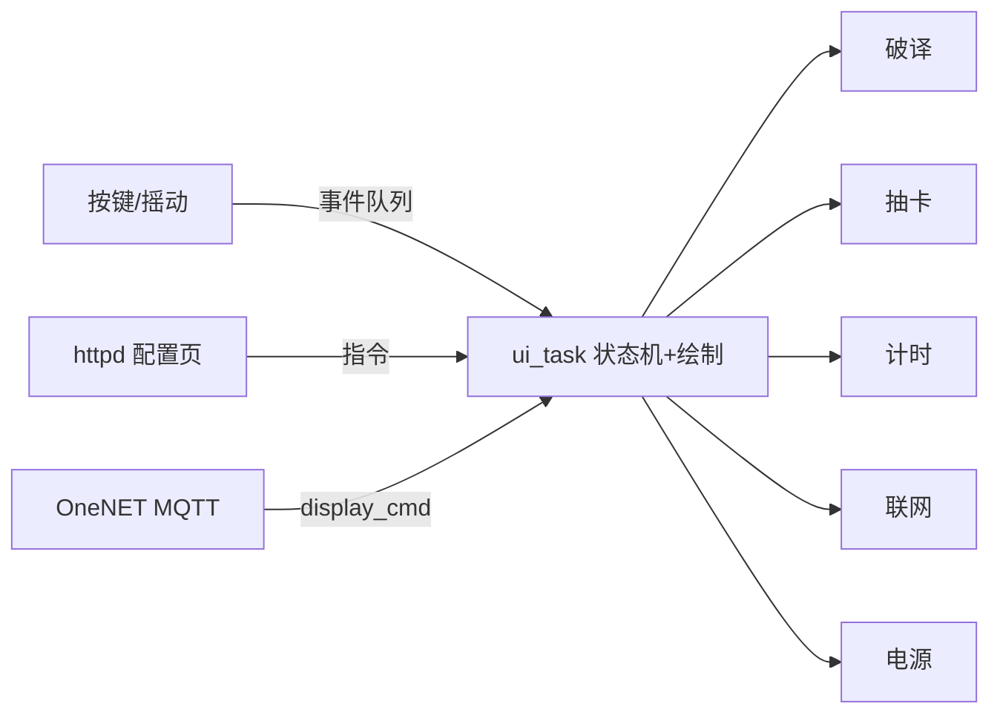

# Prescript Beeper · ESP32-S3 食指BB机

一台传呼机造型的桌面个人终端：284×76 UI、三键/摇动、蜂鸣音效。  
时钟天气 · 指令乱码破译 · 抽卡拼点 · 闹钟倒计时 · 待办 · 答案之书 · 每日神谕。  
手机/电脑浏览器可完成**离线配网、全量配置与指令下发**。

**平台：** ESP32-S3 (WROOM-1 N16R8) · ESP-IDF v5.5.5 · FreeRTOS · C  
**闪存：** 16MB · OTA 双分区 ota_0/ota_1 各 2MB · 版本见 `version.txt`

[English](README_EN.md)

---

## 功能

| 菜单 | 内容 |
|------|------|
| 神谕 | 随机指令，全屏乱码逐字破译（`{RAND}`、`{#RRGGBB}` 等） |
| TTL协议 | 闹钟 / 倒计时 / 番茄钟 |
| 待办 | `{TODO}` 自动入库，网页同步 |
| 联网 | 连网 / OneNET 云端 / 天气 / IP / 配网 / OTA |
| 观测 | 十连 / 单抽 / 拼点 / 图鉴 / 积分 |
| 询问 | 答案之书（内置 + 网页自定义） |
| 使用者 | 多使用者切换与专属指令 |
| 设置 | 音量/息屏/主题/光标/摇动/系统信息 |
| *织机* | 隐藏彩蛋：主界面 Konami 手势解锁 |

另：DS1302 离线走时；浅睡眠低功耗；网页全量配置，NVS 持久化。

## 架构



- 双任务：`input_task` 按键 + `ui_task` 统一绘制（LCD 单写者）
- 组件化：破译/抽卡/计时/网络/云端/OTA 等各自独立
- 安全：POST 带 CSRF；凭据只进 NVS；配网热点密码随机


## 构建与烧录

Windows + ESP-IDF v5.5.5：

```powershell
cd oder
idf.py build
idf.py -p COM9 flash
```

或 esptool 直烧：

```powershell
python -m esptool --chip esp32s3 -p COM9 -b 460800 --before default_reset --after hard_reset write_flash `
  --flash_mode dio --flash_size 16MB --flash_freq 80m `
  0x0 build\bootloader\bootloader.bin 0x8000 build\partition_table\partition-table.bin 0x10000 build\oder.bin
```

产物：`build/oder.bin`（约 1.5MB+）。  
版本号只改根目录 `version.txt`，再 `idf.py build`。

### 按键

- 上/下：滚动；长按连发  
- OK：确认；长按返回  
- 摇动（设置里开）：上/下/左/右 = 上滑/下滑/确认/退出  

### 配网

1. **联网 → 开启配网** → 热点 `ESP32ODERAP`（密码开机随机显示）  
2. 手机连热点 → 开 `http://192.168.4.1/`  
3. 填 WiFi / 天气城市 / 心知天气 API Key → 设备转联网模式  
4. 同网后访问设备 IP 可全量管理（WiFi/指令库/闹钟/待办/主题/云端/OTA…）

## 云端 OneNET（可选）

默认关闭。开启后 MQTT 接入 OneNET Studio（`mqtt://mqtts.heclouds.com:1883`）：

- 属性：`battery` `rssi` `version` `alarm_cnt`  
- 事件：`alarm_fire` `todo_remind` `daily_sign`  
- 服务：`display_cmd`（下行指令 → 屏幕破译）

平台侧按标识符建功能；设备侧配置页填三元组。密钥只存本地 NVS。  
启用期间不进浅睡眠，耗电增加。

## 备注

- **PCB 版已实现，尚无 3D 外壳适配**  
- 仓库不内置 WiFi/API Key，首次经配置页写入  
- 变更见 [CHANGELOG](CHANGELOG.md)

## 许可证

[MIT](LICENSE)
