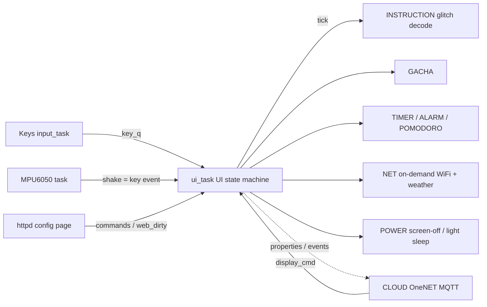

# Prescript Beeper · ESP32-S3 Pager / Personal Terminal

English · [中文](README.md)

An ESP32-S3 firmware for a desktop **pager**-shaped personal terminal: 284×76 hand-drawn UI, three buttons + shake gestures, speaker/buzzer sound effects, integrating **clock & weather / glitch-decode instructions / gacha & coin battle / alarms & timers / todos / answer book / daily oracle push / OneNET cloud (MQTT)**; a phone or PC browser can provision WiFi, change every setting, and send instructions to the screen.

- Platform: ESP32-S3 (WROOM-1 N16R8) · ESP-IDF v5.5.5 · FreeRTOS · C
- Flash: 16MB (OTA dual partitions: ota_0 / ota_1, 2MB each)
- Most code started as vibe coding, then was hardened through four systematic audits (80+ fixes); solid engineering and docs throughout
- Reusable driver library: `D:/STM32Project/Library_SK/my_esp32_lib/esp32oder` (decoupled, with usage docs)

---

## v1.20 Changes

- Docs: repo-wide comment sweep, 20+ stale comments synced (architecture header, component list, submenu order, API list, AP-item naming); Chinese & English READMEs fully synchronized
- No functional code changes

## v1.19 Changes

- Fixed: **left-shake no longer misfires as OK** — the glitch-decode reveal and the factory-reset confirm now filter shake-generated events (a left shake on the reset page could previously erase all data)
- Fixed: race between the on-device "Connect Cloud" toggle and a concurrent web save of the OneNET triplet (new `CLOUD_SetOn`, lock-held NVS write; neither side overwrites the other)
- Cleanup: redundant redraws after AP/cloud toggles, stale comments

## v1.18 Changes

- Submenus re-ordered by frequency — Network: Connect / Cloud / **Weather** / IP / AP / OTA (weather up, AP down); TTL: **Alarm** / Timer / Pomodoro; Gacha: **Ten-pull** / Single / Coin Battle / Codex / Score
- Removed: v1.17's left-column clock sync inside submenus (main-screen only again)

## v1.17 Changes

- While a glitch decode is running, **OK now reveals the full text instantly** instead of exiting; press OK again to exit (applies to every decode screen: oracle, todo re-show, system info, notices)
- Network menu "AP" item shows live state: **AP:On/Off**
- Fixed: returning from Loom → Balance now redraws the Loom menu (the full-screen balance page used to leave it wiped)

## v1.16 Changes

- Settings grouped & slimmed (14 → 12 items): Volume/Buzzer/Key-sound · Screen-off/Theme/Cursor/Font · Oracle/Window · Shake · System info/Factory reset (dangerous item last)
- **Balance (MPU attitude page) moved from Settings into the hidden Loom menu**

## v1.15 Changes

- Main menu re-ordered by usage: Oracle → TTL → Todos → Network → Gacha → Ask → User → Settings (alarms/timers moved from last to 2nd)
- Network submenu adds **Connect Cloud** (on-device OneNET on/off, same NVS as the web card, live label)
- **OTA moved from Settings into Network** (everything network-related lives in one menu)

## v1.14 Changes

- **OneNET cloud over MQTT** (new `components/CLOUD`): property reporting (battery / rssi / version / alarm_cnt, on connect + every 60 s), event reporting (alarm_fire / todo_remind / daily_sign), and downstream `display_cmd` service calls rendered through the same glitch-decode path (with invoke reply)
- Web page gains a "☁ Cloud OneNET" card (`/api/cloud`): triplet charset whitelist, DeviceKey masked
- "Remote online" is **off by default**; when on, `CLOUD_KeepAlive()` keeps WiFi alive (no light-sleep standby)
- Auth: HMAC-SHA256 device token computed on connect (matches `tools/onenet_token.py`; **new DMP platform 4-field signature** `et\nmethod\nres\nversion` — verified live against the real broker)
- Dual sub-agent code review; all findings fixed (uninitialized-id reply UB, start-failure stuck keepalive, missed standby alarms, dual-core atomic counter, exact-topic matching, etc.)

## v1.13 Changes

- Web-save NVS writes merged (25–37 commits → ≤8); async WiFi scan (POST start + GET poll); CSRF token on all POSTs; audio params passed atomically via a length-1 queue with loop-sound auto-resume; `EVT_*` centralized in `COMMON/evt.h`; gold-pool dead data removed; heap buffers for /api/cfg; SPI return-value checks, decode-param clamps, MPU6500/9250 clone support

## v1.12 Changes

- Shake no longer misfires OK on "put down/pick up" (horizontal threshold 0.8g→1.3g)
- OTA no longer killed by screen-off standby; single-pull voice state leak fixed; web alarm full-table save fixed at 16 slots; balance heading leak-integration τ 0.3s→10s; ANSWER/UI-user mutexes; balance page 10 fps cap

## Older

- v1.11: system info page (project/version/build time), OTA live percentage + GitHub 302, manual-only STA
- v1.06: Pomodoro main-loop fix, web save stability, theme persistence, reusable `pomodoro_drv` / `power_drv`

## Features

### Main menu

| Menu | Function |
|------|----------|
| **Oracle** | Pull a random instruction, full-screen glitch decode (inline `{RAND}`, `{#RRGGBB}` tags) |
| **TTL** | Alarm / Countdown / Pomodoro |
| **Todos** | Instruction log: `{TODO}` auto-captured, PASS marking, web sync |
| **Network** | Connect / Cloud (OneNET switch) / Weather / IP / AP provisioning / OTA update |
| **Gacha** | Ten-pull / Single / Coin Battle / Codex / Score |
| **Ask** | Answer book: answer / what to eat / drink / play (built-in + web-customized) |
| **User** | Switch the active user (web can add); each user receives their own private instructions |
| **Settings** | Volume/buzzer/key-sound; screen-off/theme/cursor/font; oracle/window; shake; system info, factory reset |
| *Loom (hidden)* | Easter egg unlocked by Konami gesture (Up Up Down Down Left Right Left Right): time acceleration, white-box filter, balance page |

### Highlights

- **Glitch decode**: full-garble jitter then per-char reveal; `{#RRGGBB}` color, `{RAND:min-max}`, `{TODO}` auto-todo; 16/24/32/64 px fonts; OK reveals the text instantly mid-decode.
- **Gacha**: ten-pull scanline animation, gold-voice typewriter, score pulls; **coin battle** mini-game with damage/streak scoring; 12 sinners × 120 identities codex.
- **Time management**: alarms (daily/weekdays/weekends/once/custom), countdown beep + auto wake, pomodoro cycles, scheduled daily oracle.
- **Offline-first**: DS1302 shows time instantly (battery-backed); every local feature works without network.
- **Light-sleep low power**: 50 ms tick sleep + suspended sensor task + WiFi off; reconnect is manual via Network → Connect (Cloud mode keeps the link alive instead).
- **Full web config**: WiFi/weather/library/theme/alarms/todos/users/decode params/codex/cloud — all persisted in NVS.

## Architecture & Engineering



- **Component layering**: 16 functional components + a `COMMON` shared header; UI framebuffer drawing APIs are reused by decode/gacha/timer full screens.
- **Event-driven tasks**: high-priority input polling + a single ui_task state machine owning all drawing (single LCD writer, no concurrent tearing); cloud_task runs the MQTT session independently.
- **Concurrency discipline**: mutexes on every httpd/UI-shared dataset; sound params passed atomically via a length-1 queue; drawing unified in ui_task.
- **Four systematic audits**: two full-codebase sweeps + two cloud-focused sub-agent cross reviews, 80+ fixes (web-save transactionalization, NVS write merging 37→≤8 commits, dual-core races, shake-source filtering, comment drift).
- **Security**: CSRF token on all web POSTs; WiFi/weather/OneNET credentials only in NVS, never in source; randomized AP password per device.
- **Release discipline**: `version.txt` single source of version; OTA dual partitions + SHA256 + boot rollback guard; GitHub Releases ship firmware + notes.

## Cloud OneNET (optional, v1.14)

"Remote online" is off by default and affects nothing locally. When enabled the device talks MQTT to China Mobile's OneNET IoT platform at `mqtt://mqtts.heclouds.com:1883` (clientId = device name, username = product ID, password = HMAC-SHA256 auth token):

| Link | Content | Cadence |
|------|---------|---------|
| Properties | `battery` / `rssi` / `version` / `alarm_cnt` | on connect + every 60 s |
| Events | `alarm_fire` / `todo_remind` / `daily_sign` (param `msg`) | on trigger |
| Downlink | `display_cmd` service (param `msg`) → glitch-decode on screen + reply | anytime |

### Platform side (OneNET console)

1. Register at [open.iot.10086.cn](https://open.iot.10086.cn) (real-name verification) → IoT Platform → create a product: **MQTT** access, **OneJSON** data protocol, **WiFi**.
2. Define the thing model exactly as the table above (**identifiers must match**): 4 properties, 3 events (`msg` text param), 1 service `display_cmd` (`msg` text, `timeout` int32).
3. Create a device; note the triplet **ProductID / DeviceName / DeviceKey**.
4. Optional pre-check on PC: `python tools/onenet_token.py <ProductID> <DeviceName> <DeviceKey>`, then connect MQTTX to `mqtt://mqtts.heclouds.com:1883` (clientId=DeviceName, username=ProductID, password=token) — "online" on the platform confirms the triplet.

### Device side

With WiFi connected, open the config page → "☁ Cloud OneNET" card: enter the triplet, enable, save. DeviceKey lives only in device NVS (masked in the web UI). The device-side Network → Cloud toggle flips the same switch.

> Note: while enabled the device stays online and skips light-sleep standby (higher idle current); a leaked DeviceKey can be reset on the platform. Offline downstream commands are dropped by design.

## Hardware

### Wiring (ESP32-S3)

| Module | Pins |
|--------|------|
| LCD ST7789 284×76 (SPI2 60MHz) | SCL=`7` SDA=`8` CS=`9` RST=`10` DC=`11` BLK=`12` (active-low backlight) |
| Keys Up / Down / OK (internal pull-ups, active-low; PCB rev.: Up=`5` Down=`6` OK=`4`) | see left |
| Active buzzer (active-low) | `15` |
| MAX98357A amp (I2S) | BCLK=`16` LRC=`17` DIN=`18` SD=`13` (low = muted) |
| DS1302 RTC (3-wire bit-bang) | CLK=`2` DAT=`14` CE/RST=`21` |
| MPU6050 IMU (software I2C) | SCL=`39` SDA=`38` |
| Battery ADC (1S Li-ion, 1:1 divider) | `1` (ADC1_CH0) |
| Serial log (115200) | `43`(TX) `44`(RX) |

> To move pins: keys in `components/UI/UI.h`; everything else is documented at the top of each component's `.c`. Avoid GPIO35/36/37 (PSRAM), GPIO48 (onboard RGB) and strapping pins on N16R8.

## Usage

### Build & flash

Environment: Windows + ESP-IDF v5.5.5, USB serial driver installed.

**Option A · ESP-IDF native (recommended)**

```powershell
cd oder
idf.py build
idf.py -p COM9 flash
```

**Option B · esptool direct**

```powershell
python -m esptool --chip esp32s3 -p COM9 -b 460800 --before default_reset --after hard_reset write_flash `
  --flash_mode dio --flash_size 16MB --flash_freq 80m `
  0x0 build\bootloader\bootloader.bin 0x8000 build\partition_table\partition-table.bin 0x10000 build\oder.bin
```

Artifact: `build/oder.bin` (~1.6 MB).

### Keys

- **Up / Down**: scroll; hold for repeat.
- **OK**: confirm / enter.
- **Long-press OK**: back / exit current screen.
- **Shake** (enable in Settings → Shake): shake up = scroll up, down = scroll down; left/right map to OK / long-OK.
- During a glitch decode, **OK reveals the text instantly**; press again to exit.

### Provisioning & web config

1. Main menu **Network → AP**: hotspot `ESP32ODERAP` starts (random password shown on screen).
2. Join it from a phone → the config page **pops up automatically** (captive portal), or open `http://192.168.4.1/`.
3. Scan & save your WiFi, set weather city and **weather API key (Seniverse)**; the device switches to station mode.
